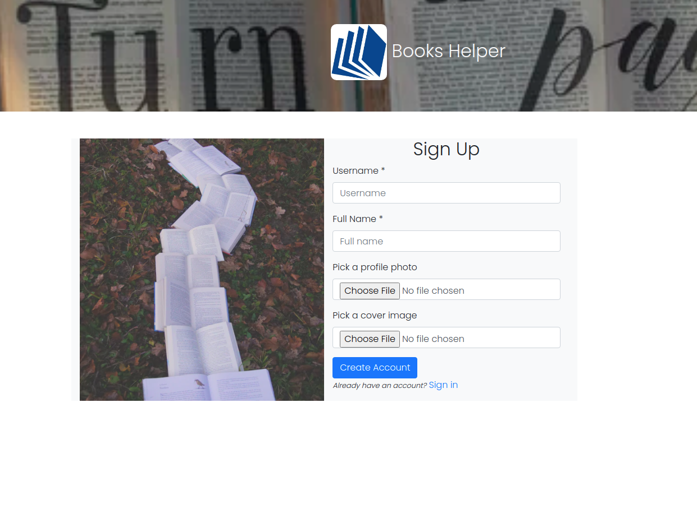
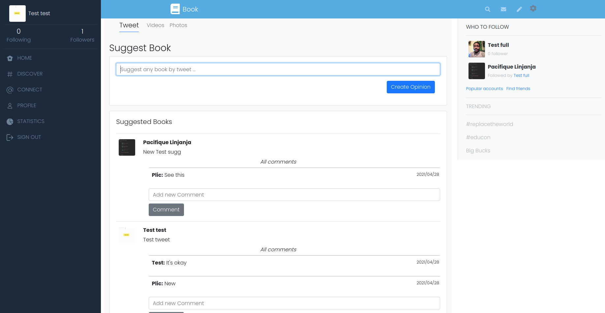

# Ruby On Rails Capstone Project - Books Helper

> This project is a Books helper based on Twitter Web App that allows users to share opinions on a specific book made in Ruby On Rails

## GET STARTED

#### Requirements 

- At least one code editor installed (VS Code for example)
- Git installed
- Ruby installed
- At least one web browser
#### Clone the repository

- Click on the "code" button above on this page and copy the link to the repository
- Run `git clone git@github.com:pacyL2K19/books-helper.git`
- Go to the cloned repository run `cd books-helper`

#### Install required Gem and Node packages

- In the terminale, run 
    ```
    $ bundle install
    ```
- [optional] Run 
    ```
    $ bundle update
    ```
- Install node packages nun
    ```
    $ yarn install --check-files
    ```

#### Set up the database tables 

- In `./config/database.yml` file, update the username and the password by yours
- Run `rails db:create` and make sure the commande succeded
- Run `rails db:migrate` and make sure the commande succeded

#### Test all in the browser

- Run `$ rails server`
- In the browser go to http://127.0.0.1:3000/users/new
- This page should display (for the first loading)
- 
- Create a new user by putting informations inside the text fields and importing images for the profile and the cover (Not mandatory)
- 
- After loging in, this main screen should display 
- 
- Suggest any book and here we go ...
- Follow any user on the right-side menu

Run the [Live Demo](https://limitless-reef-60126.herokuapp.com/)

#### Run the tests
```
$ rails db:migrate RAILS_ENV=test
$ rspec --format documentation
```
## 🤝 Contributing

Contributions, issues and feature requests are welcome following a correct gitflow workflow !

## Acknowledgments 🤝

A special thanks to [Gregoire Vella](https://www.behance.net/gregoirevella) for this project, which took guidance on his project idea. The original page to check is [here](https://www.behance.net/gallery/14286087/Twitter-Redesign-of-UI-details).
## Authors

👤 **Pacifique Linjanja**
- Github: [@pacyL2K19](https://github.com/pacyL2K19)
- Twitter: [@PacifiqueLinja1](https://twitter.com/PacifiqueLinja1)
- Linkedin: [Pacifique Linjanja](https://www.linkedin.com/in/pacifique-linjanja/)
